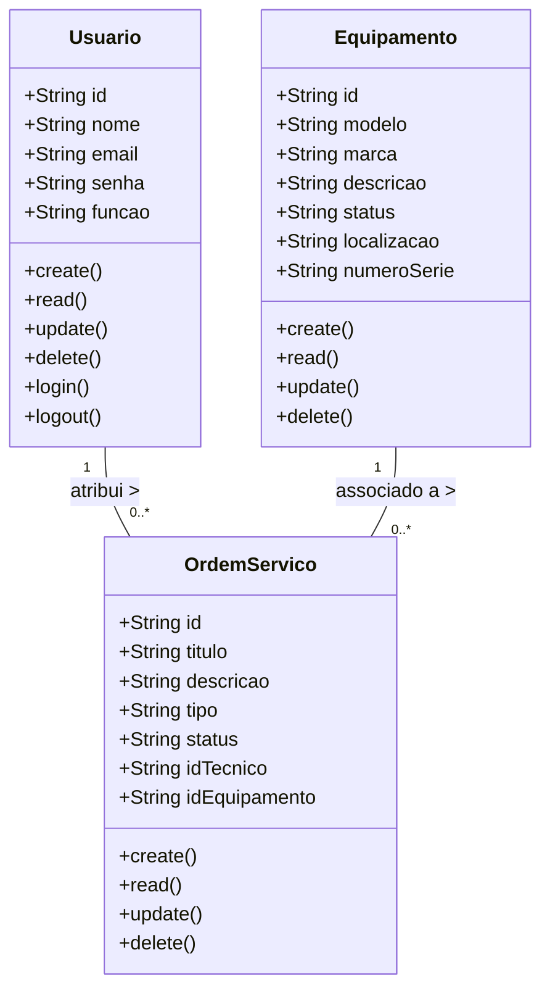
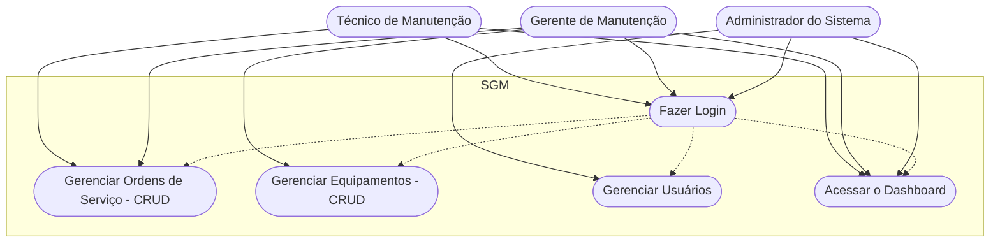
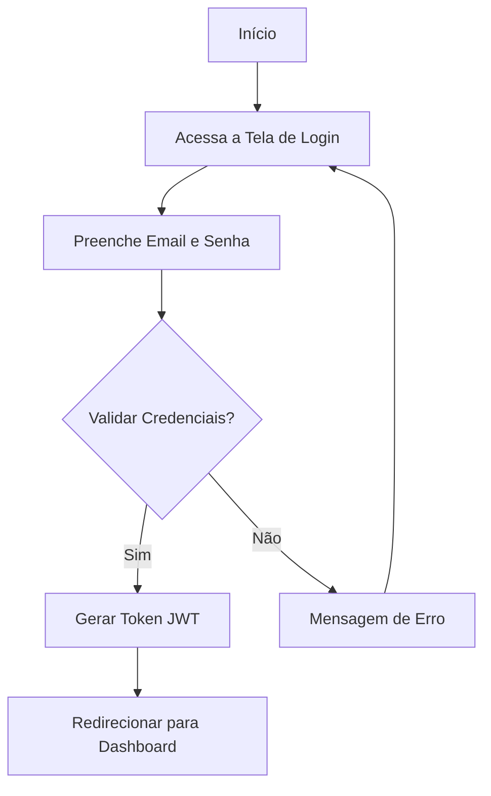

// ...existing code...
# 🧰 Sistema de Gestão de Manutenção (SGM)

## 📋 Briefing
O **Sistema de Gestão de Manutenção (SGM)** é uma aplicação web para centralizar e otimizar o controle das atividades de **manutenção de máquinas e equipamentos** de uma empresa.  
Permite **cadastro de equipamentos**, **agendamento de manutenções preventivas e corretivas**, e **gerenciamento de ordens de serviço**, com dashboards por perfil de usuário.

---

## 🎯 Objetivos do Projeto
- Gerenciar informações sobre **equipamentos** e **manutenções** da empresa  
- Realizar **abertura e controle de ordens de serviço**  
- Visualizar **informações em dashboards**  

---

## 👥 Público-Alvo

| Perfil | Atribuições no Sistema |
|--------|------------------------|
| **Técnicos** | Criar e gerenciar ordens de serviço |
| **Gerentes** | Gerenciar ordens e equipamentos |
| **Administradores** | Gerenciar usuários, perfis e acesso |

---

## 📦 Requisitos

### ✅ Requisitos Funcionais
- CRUD de **Ordens de Serviço**  
- CRUD de **Usuários**  
- CRUD de **Equipamentos**  
- **Login** seguro (email e senha)  
- **Dashboard** por perfil de usuário  

### ⚙️ Requisitos Não Funcionais
- Banco de Dados **MongoDB**  
- **Criptografia** de senha com bcrypt  
- **JWT** para autenticação  
- **Middlewares** para controle de acesso  

---

## 💻 Recursos Tecnológicos

| Recurso | Descrição |
|---------|-----------|
| Framework | Next.js |
| Linguagem | TypeScript |
| Banco de Dados | MongoDB |
| Controle de Versão | GitHub |
| Editor | VS Code |
| Prototipação | Figma ([link](https://www.figma.com/design/ZjIS7c8HkupmEsmNabvcfX/Untitled?node-id=0-1&t=4wslqLXVAubbHQc4-1)) |

---

## 🧩 Diagramas do Sistema

### 🧱 Diagrama de Classes


---

## 🎭 Diagrama de Casos de Uso


---

## 🔄 Diagrama de Fluxo (Login)


---

## ⚠️ Análise de Riscos

### 🧠 Riscos Técnicos
| ID | Risco | Probabilidade | Impacto | Mitigação |
|----|-------|---------------|---------|----------|
| 1 | Chave secreta do JWT comprometida | Média | Alto | Usar chaves fortes, armazenar em variáveis de ambiente e rotacionar periodicamente |
| 2 | Vulnerabilidade no bcrypt | Baixa | Alto | Garantir senhas ≤ 72 bytes e evitar concatenação antes do hash |
| 3 | Lentidão com alto volume de dados | Média | Médio | Indexar consultas e implementar paginação |
| 4 | Código com bugs e má qualidade | Alta | Médio | Fazer code review e testes automatizados |

### 🗂️ Riscos de Gerenciamento
| ID | Risco | Probabilidade | Impacto | Mitigação |
|----|-------|---------------|---------|----------|
| 5 | Aumento do escopo (Scope Creep) | Alta | Médio | Controlar mudanças e revisar impactos antes de aceitar |
| 6 | Atraso na entrega | Alta | Médio | Adotar metodologia ágil e revisar cronograma por sprint |
| 7 | Requisitos mal interpretados | Média | Alto | Validar protótipos com usuários e manter comunicação constante |

### 🏢 Riscos Organizacionais
| ID | Risco | Probabilidade | Impacto | Mitigação |
|----|-------|---------------|---------|----------|
| 8 | Resistência dos usuários ao sistema | Média | Alto | Treinar usuários e comunicar benefícios |
| 9 | Inserção de dados incorretos | Média | Alto | Implementar validação nos formulários |
| 10 | Falta de treinamento dos usuários | Média | Médio | Criar manuais e realizar capacitação prática |

---

## 🧪 Protótipo do Sistema
A prototipação visual inclui telas de login, dashboard e módulos de gerenciamento de usuários, equipamentos e ordens de serviço.

🔗 Protótipo no Figma: https://www.figma.com/design/ZjIS7c8HkupmEsmNabvcfX/Untitled?node-id=0-1&t=4wslqLXVAubbHQc4-1

---

## 🧱 Estrutura dos Controladores (Controllers)

- UsuarioController  
  CRUD completo e autenticação (login/logout)

- EquipamentoController  
  CRUD completo de equipamentos (modelo, marca, localização, etc.)

- OrdemServicoController  
  CRUD completo de ordens de serviço (título, descrição, tipo, status, técnico e equipamento)

---

## 🧭 Conclusão
O Sistema de Gestão de Manutenção (SGM) aumenta a eficiência e organização das atividades de manutenção industrial, reduz falhas, melhora a comunicação e centraliza dados em uma plataforma segura, escalável e moderna.
```// filepath: c:\Users\DevCastelloA\Desktop\Daniel\CursoFrontEnd2\Frameworks\Next\formativa-sgm\README.md
// ...existing code...

```

# 🧰 Sistema de Gestão de Manutenção (SGM)

## 📋 Briefing
O **Sistema de Gestão de Manutenção (SGM)** é uma aplicação web para centralizar e otimizar o controle das atividades de **manutenção de máquinas e equipamentos** de uma empresa.  
Permite **cadastro de equipamentos**, **agendamento de manutenções preventivas e corretivas**, e **gerenciamento de ordens de serviço**, com dashboards por perfil de usuário.

---

## 🎯 Objetivos do Projeto
- Gerenciar informações sobre **equipamentos** e **manutenções** da empresa  
- Realizar **abertura e controle de ordens de serviço**  
- Visualizar **informações em dashboards**  

---

## 👥 Público-Alvo

| Perfil | Atribuições no Sistema |
|--------|------------------------|
| **Técnicos** | Criar e gerenciar ordens de serviço |
| **Gerentes** | Gerenciar ordens e equipamentos |
| **Administradores** | Gerenciar usuários, perfis e acesso |

## 📦 Requisitos

### ✅ Requisitos Funcionais
- CRUD de **Ordens de Serviço**  
- CRUD de **Usuários**  
- CRUD de **Equipamentos**  
- **Login** seguro (email e senha)  
- **Dashboard** por perfil de usuário  

### ⚙️ Requisitos Não Funcionais
- Banco de Dados **MongoDB**  
- **Criptografia** de senha com bcrypt  
- **JWT** para autenticação  
- **Middlewares** para controle de acesso  

---

## 💻 Recursos Tecnológicos

| Recurso | Descrição |
|---------|-----------|
| Framework | Next.js |
| Linguagem | TypeScript |
| Banco de Dados | MongoDB |
| Controle de Versão | GitHub |
| Editor | VS Code |
| Prototipação | Figma ([link](https://www.figma.com/design/ZjIS7c8HkupmEsmNabvcfX/Untitled?node-id=0-1&t=4wslqLXVAubbHQc4-1)) |

---

## 🧩 Diagramas do Sistema

### 🧱 Diagrama de Classes


---

## 🎭 Diagrama de Casos de Uso


---

## 🔄 Diagrama de Fluxo (Login)


---

## ⚠️ Análise de Riscos

### 🧠 Riscos Técnicos
| ID | Risco | Probabilidade | Impacto | Mitigação |
|----|-------|---------------|---------|----------|
| 1 | Chave secreta do JWT comprometida | Média | Alto | Usar chaves fortes, armazenar em variáveis de ambiente e rotacionar periodicamente |
| 2 | Vulnerabilidade no bcrypt | Baixa | Alto | Garantir senhas ≤ 72 bytes e evitar concatenação antes do hash |
| 3 | Lentidão com alto volume de dados | Média | Médio | Indexar consultas e implementar paginação |
| 4 | Código com bugs e má qualidade | Alta | Médio | Fazer code review e testes automatizados |

### 🗂️ Riscos de Gerenciamento
| ID | Risco | Probabilidade | Impacto | Mitigação |
|----|-------|---------------|---------|----------|
| 5 | Aumento do escopo (Scope Creep) | Alta | Médio | Controlar mudanças e revisar impactos antes de aceitar |
| 6 | Atraso na entrega | Alta | Médio | Adotar metodologia ágil e revisar cronograma por sprint |
| 7 | Requisitos mal interpretados | Média | Alto | Validar protótipos com usuários e manter comunicação constante |

### 🏢 Riscos Organizacionais
| ID | Risco | Probabilidade | Impacto | Mitigação |
|----|-------|---------------|---------|----------|
| 8 | Resistência dos usuários ao sistema | Média | Alto | Treinar usuários e comunicar benefícios |
| 9 | Inserção de dados incorretos | Média | Alto | Implementar validação nos formulários |
| 10 | Falta de treinamento dos usuários | Média | Médio | Criar manuais e realizar capacitação prática |

---

## 🧪 Protótipo do Sistema
A prototipação visual inclui telas de login, dashboard e módulos de gerenciamento de usuários, equipamentos e ordens de serviço.

🔗 Protótipo no Figma: https://www.figma.com/design/ZjIS7c8HkupmEsmNabvcfX/Untitled?node-id=0-1&t=4wslqLXVAubbHQc4-1

---

## 🧱 Estrutura dos Controladores (Controllers)

- UsuarioController  
  CRUD completo e autenticação (login/logout)

- EquipamentoController  
  CRUD completo de equipamentos (modelo, marca, localização, etc.)

- OrdemServicoController  
  CRUD completo de ordens de serviço (título, descrição, tipo, status, técnico e equipamento)

---

## 🧭 Conclusão
O Sistema de Gestão de Manutenção (SGM) aumenta a eficiência e organização das atividades de manutenção industrial, reduz falhas, melhora a comunicação e centraliza dados em uma plataforma segura, escalável e moderna.